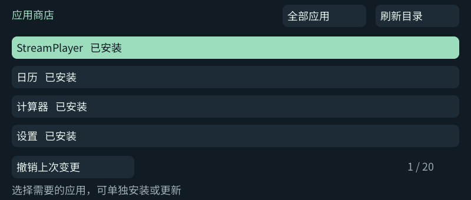
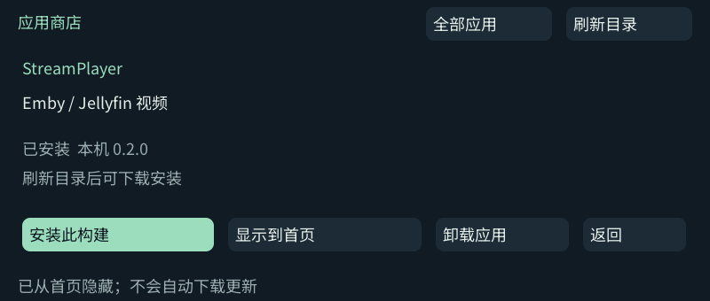

# 应用商店

按需安装、单独更新和首页管理。现有已安装应用保持可见；未安装的应用仅列在商店中，刷新只拉取小型目录，不下载程序。关闭首页显示不卸载数据，也不会自动更新。

- W/S 选择，回车打开详情；R 刷新，T 切换全部／已安装。
- 详情可安装或更新当前一个应用、切换首页可见性、卸载。
- 同版本但源码修订不同不会标成“更高版本”，安装前需要确认；远端版本较旧时拒绝降级。
- 卸载保留个人数据与回退副本；“撤销上次变更”恢复上次安装／可见性状态。
- 商店入口始终保留。Launcher、字体与公共运行时属于基础安装，不作为普通可卸载应用；基础运行时升级仍通过电脑部署。

公开 `store/catalog.json` 指向 GitHub Releases 的逐应用 `.c1pkg` 包。HTTPS 校验证书，下载后校验包与每个文件的 SHA-256，再原子切换菜单与应用目录。哈希用于发现损坏，不是独立于 GitHub 的发布者签名。版本目录保留用于回退，首次基础安装中的程序也仍在原来的 release 中。

应用商店状态及安装包位于 `/storage/apps/data/appstore/`。用户资料仍位于各应用原有的 data 目录。相同版本的不同构建需要用户判断，不能按哈希推断先后。

## 真机界面

| 应用目录 | 单应用管理 |
| --- | --- |
|  |  |
