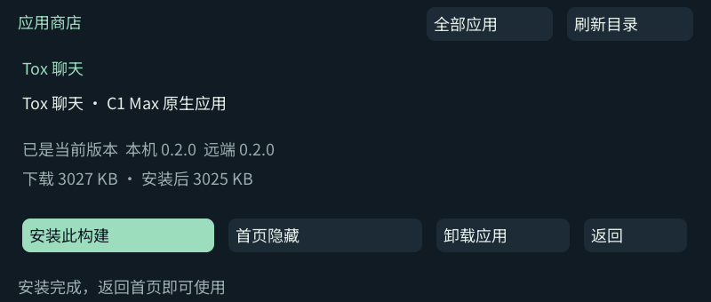

# Tox 0.2.0 与应用商店验收

## Tox

- 在公共 Docker builder 中运行两个隔离身份的真实回环 Tox 通信：人工好友接受、UTF-8 消息、回执、附件手动接受、分块字节完整性、取消与路径拒绝通过。取消同一文件的第二次传输不会把第一次已完成记录改成取消。
- 身份、好友和记录持久化、损坏身份保护及备份恢复回归通过。
- IPC 服务测试覆盖后台开启后退出、重新连接同一身份、关闭后约三秒退出，以及显式停止服务。测试服务资料在 Linux `/tmp`；Mac Docker 共享目录不支持用于该测试的 Unix socket。
- 真机隔离身份测试通过拍摄键拍照、确认预览、返回放弃；镜头当时朝向暗处，未验证新场景的对焦画质。
- 真机录音生成约 1.3 秒、16 kHz 单声道 WAV；试听经 MPlayer `media` 音频输出正常结束。
- 真机确认后台服务独立于 UI 存活、重新进入后复用，并在关闭后台后退出。
- 没有向真实联系人发送消息或附件。未完成其他厂商 Tox 客户端的跨网长期互通；JPEG/WAV 使用 toxcore 标准文件传输。

## 应用商店

- 公共构建输出 20 个独立可选应用包；launcher 与共享运行时由基础安装维护。
- 电脑端验证目录显隐、单个卸载、状态回退、商店入口保护、版本比较、包和文件 SHA-256 校验。
- 真机在隔离应用清单中验证触摸进入详情、首页隐藏／恢复、单个卸载与撤销；未删除用户个人资料。
- 安装使用全新目录，文件校验及落盘后切换一份完整的菜单／根目录状态。文件数据保存在各应用原 data 目录，安装包不带账号或身份。
- 已发布 [20 个独立应用包](https://github.com/zhuzhe1983/C1Max-Apps/releases/tag/apps-20261002-media-store)，并在真机商店通过 GitHub API 刷新公开目录。
- 真机从 GitHub 下载约 3027 KB 的 Tox 包，完成校验与安装；安装记录中只有 Tox 使用下载目录，其余 19 项保持原状。下载后的程序 SHA-256 与公开构建一致，并已打开隔离测试身份的界面。
- 同版本但不同构建在安装前明确确认，成功后显示“已是当前版本”。没有将本地修订哈希当成可排序的版本号。
- 最终基础安装为 `20261002-214442-6376390c`。在正常首页隐藏钢琴后，应用数量从 20 变为 19，商店入口置于首项；重新显示后恢复全部 20 项。验证结束保留正常首页，测试后台服务已停止，休眠与背光锁恢复为 0。

图见 [截图说明](screenshots/README.md)。照片环境与实际录音未发布。
