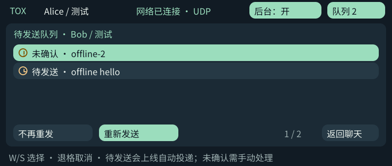

# Tox 0.3.0 离线待发队列验收

- 默认构建启用，文字、JPEG 和 WAV 均先落盘再确认入队。待发项保存在各好友聊天记录中；相机／录音文件同步落盘后才入队。
- 电脑与真机运行相同的 `tox-outbox-test`，各使用两个专用身份，仅通过 `127.0.0.1` 相互引导，不发送给真实联系人。
- 验证每好友 32 条上限、取消、60 条历史修剪时保留待发项、无法写入时不确认入队、重启恢复、删除好友后不复活队列，以及损坏记录不会被静默覆盖。
- 将测试记录分别置于“发送意图已落盘”和“已交给网络”状态模拟崩溃窗口：重启后均为未确认，不自动重发。明确操作重发后可收到正常回执。
- 发送方 IPC 前端断开后，收件人上线：后台依序补发 27 条文字和两个附件请求；收件人手动接受后，WAV/JPEG 字节与源文件一致。再次重启发送服务后，收件人记录数没有增长。
- 已有文字回环、附件接受／拒绝、同文件重复传输取消、身份保存与损坏身份保护、后台开关和服务生命周期回归通过。
- 真机实体按键事件注入：离线输入 `offline hello` 并回车后，输入框清空、记录显示“待发送”；退出界面重新进入后队列仍在。退格进入取消确认，回车确认后状态持久化为取消。
- 新旧记录兼容：旧已发出但无回执的消息继续显示未确认；新入队项才自动投递。没有通过文本内容去重，不会误吞用户主动发送的相同文字。

以上截图来自设备 framebuffer，仅转换像素格式和方向，使用专用测试身份。没有上传身份、实际相机画面、录音或私人聊天。未验证第三方客户端的长期跨网互通，也不宣称断电时恰好一次投递；不确定结果由用户确认是否重发。

## 2026-10-03 气泡与直接预览补验

- 真机两个隔离身份进行实际双向聊天，灰色勾表示 `tox_friend_send_message` 接受发送，绿色圆勾只在收到对应文本回执后出现。为截取短暂的“已发出”，临时暂停专用收件服务，截图后立即恢复，随后确认变成“已送达”。不是伪造消息状态，也不把送达称为已读。
- 两个测试身份实际传输有效 JPEG 和 3 秒 PCM WAV，接收端仍需接受。聊天气泡自动显示缩略图、语音时长；图片点击放大后返回聊天，语音点击播放／停止，正常 EOF 后恢复播放按钮。
- 图片测试内容为仓库 Tox 图标转换的 JPEG；语音为生成的静音 WAV，均不含用户相机／录音内容。图片与语音没有自动播放。
- 电脑端 `tox-media-preview-test` 覆盖缩略图尺寸上限、WAV 时长、截断文件和路径拒绝。气泡仅渲染当前六条记录，缩略图缓存有界；不为所有历史照片持续占用内存。
- 真机注入 Shift 与音量键组合：向上滚动的聊天区域像素发生变化，反向滚动后恢复原图；音量服务没有产生 `softvolume` 修改记录。普通音量 −／＋各产生一次音量修改；离开聊天页后滚动快捷键标记移除。
