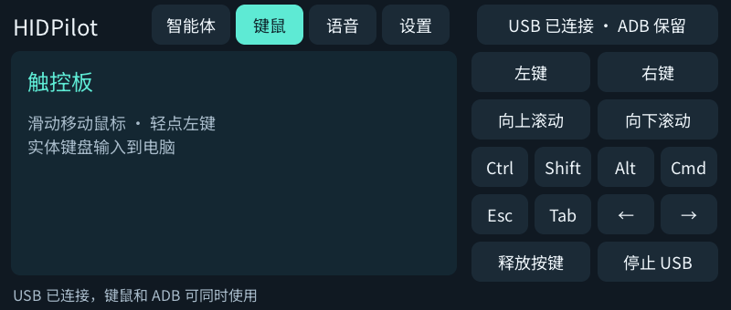
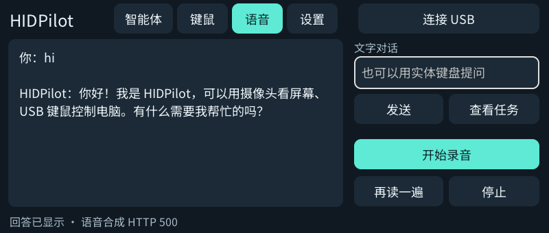

# HIDPilot

C1 Max 上的 USB 键鼠与摄像头智能体，带按键录音、语音识别、文字对话和语音播报。电脑只使用系统 HID 驱动；模型运行在可配置的服务器上。

## 使用

1. 用数据线连接电脑，在应用右上角点 **连接 USB**。首次连接可能出现系统键盘识别提示；USB 重新枚举时 ADB 会短暂断线，随后与 MTP、HID 共存。
2. **键鼠**：词典触屏作为触控板，实体键盘向电脑输入。支持左右键、滚轮、Ctrl / Shift / Alt / Cmd 和常用按键。当前使用美式键盘映射，直接输入 ASCII；中文需要电脑输入法。
3. **智能体**：固定词典，让电脑主显示器完整入镜。点 **校准**，依次选择左上、右上、右下、左下四角；可手动调焦。输入任务后点 **单步**或**运行 10 步**。每步重新拍照、校正透视、请求模型，再发送一个经过校验的键鼠动作。移动词典或显示器后需要重新校准。
4. **语音**：点 **开始录音**或实体拍摄键，再按一次结束，最长 10 秒。识别后进行对话并尝试播报；也能用实体键盘输入文字。电脑操作请求会填入任务栏，点 **查看任务**后手动启动。语音聊天不会自行发送 USB 操作。
5. **返回键**立即停止任务、录音或播报，并释放按键；**电源键**退出应用，恢复原来的 USB 功能。关闭 USB 后可继续语音聊天。

当前不是持续监听或全双工通话。每轮最多 10 个动作，鼠标仅针对主显示器；不支持拖拽、复杂多显示器布局或直接发送 Unicode。模型会出错，先使用单步检查定位。

## 界面

| USB 键鼠 | 语音与文字对话 |
| --- | --- |
|  |  |

均为真机画面。对话文字来自真实模型；当前测试服务器的播报故障另见验证记录。

## 模型设置

四个服务独立配置完整 URL、模型名和可选 Bearer API 密钥：

| 服务 | OpenAI 兼容接口 | 用途 |
| --- | --- | --- |
| 视觉 | `/v1/chat/completions` | JPEG 图像与受限 JSON 动作 |
| 对话 | `/v1/chat/completions` | 简短中文回答与待执行任务 |
| 识别 | `/v1/audio/transcriptions` | multipart WAV，16 kHz 单声道 |
| 播报 | `/v1/audio/speech` | WAV 输出，使用服务器默认音色 |

测试使用 LocalAI 的 Qwen3.8 27B 视觉模型、4B 对话模型、Qwen3 ASR 和 Faster Qwen3 TTS。对话模型与视觉模型分开配置，避免每句聊天都调用大视觉模型。公共构建不包含服务器地址、账号或密钥。

设置保存在设备 `/storage/apps/data/hidpilot/settings.json`，权限 0600。开发机可将同结构配置放在已忽略的 `config/hidpilot.local.json`，通过 `tools/configure.py --serial SERIAL` 单独同步；不会加入公开安装包，也不会覆盖其他应用设置。参考 [settings.example.json](settings.example.json)。

录音仅在按下录音键后开始；文件在识别或取消后删除。屏幕照片仅在启动智能体步骤时发送到视觉服务器，不写入相册。对话记录只保留内存中的最近三轮；退出即清除。密钥不放入命令行参数，错误提示不展示完整服务响应。

## USB 实现

设备原内核没有可用的 `f_hid` / `/dev/hidg*`，因此使用 Linux FunctionFS 创建会话内 HID 接口。一个 interrupt-IN 端点承载键盘、绝对鼠标和相对鼠标三个报告，LED 控制通过 ep0，给 ADB / MTP 留出端点。

`c1max-hidpilot-usb` 只临时增加 `ffs.hidpilot`，不修改启动脚本、VID/PID 或原 USB 功能。界面通过私有 Unix socket 提交有长度和范围校验的报告。退出、客户端断开或启动超时会恢复原配置。独立清理进程保留 FunctionFS 文件描述符，以便工作进程异常退出时恢复 USB；真实硬件验证范围见下方记录。

参考：[Linux FunctionFS](https://docs.kernel.org/usb/functionfs.html)、[HID gadget](https://docs.kernel.org/usb/gadget_hid.html)。首次连接和退出各有一次 USB 重新枚举，不能承诺 ADB 全程零中断；异常掉电或设备休眠仍可能需要重新连接。

## 构建和验证

跟随仓库 `tools/build.sh` 编译并打包。Linux 主机回归测试：

```sh
python3 hidpilot/tests/run.py
```

需要 C++17、nlohmann/json、GNU wget、Python 3；测试使用明确的本地 HTTP fixture，覆盖 HID 报告位数、ASCII 映射、透视校准、动作拒绝规则、语音 API 编解码和请求取消。这些测试不连接真实电脑或模型。

可显式构建 `c1max-hidpilot-service-test`，只测试模型接口，不打开摄像头、不录音、不发送 HID。`tools/usb-send.cpp` 是人工诊断工具，不放入安装包；使用前必须确认电脑焦点位于专用测试窗口。

当前服务与真机验收记录：[2026-09-27 HIDPilot](../docs/2026-09-27-hidpilot-qa.md)。
