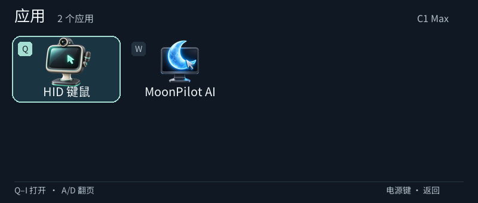

# HID 键鼠

C1 Max 的 USB 键盘、鼠标和触控板。0.2.0 起只负责手动输入；AI、模型设置和语音功能迁入独立的 [MoonPilot](../moonpilot/README.md)。沿用 `hidpilot` 应用 ID，升级不删除旧设置。

## 使用

1. 用数据线连接电脑，点右上角 **连接 USB**。首次可能出现系统键盘识别提示；重新枚举时 ADB 会短暂断线，随后与 MTP、HID 共存。
2. 滑动触控板移动鼠标，轻点左键；右侧提供左右键、滚轮、Ctrl / Shift / Alt / Cmd、Esc / Tab / 左右方向键。修饰键可锁定，再次点击或点“释放按键”解除。
3. 实体键盘直接向电脑输入。右上键为退格、右下键为回车；双击实体 Shift 切换大写，Shift 组合输入键帽符号。当前是美式 ASCII 映射，中文需使用电脑输入法。
4. 中间返回键释放按键；电源键回 launcher。点“停止 USB”或退出会恢复原来的 USB 功能。

电脑无需额外控制软件，使用系统 HID 驱动。此应用不打开摄像头、不请求模型，也不会自动录音。

## USB 实现

原内核没有可用的 `f_hid` / `/dev/hidg*`，使用 Linux FunctionFS 创建会话内 HID 接口。一个 interrupt-IN 端点承载键盘、绝对鼠标和相对鼠标三个报告，LED 控制通过 ep0，给 ADB / MTP 留出端点。

`c1max-hidpilot-usb` 临时增加 `ffs.hidpilot`，不修改启动脚本、VID/PID。界面通过私有 Unix socket 提交有长度和范围校验的报告。退出、客户端断开或启动超时恢复原配置。独立清理进程保留 FunctionFS 描述符，处理工作进程异常退出。

参考：[Linux FunctionFS](https://docs.kernel.org/usb/functionfs.html)、[HID gadget](https://docs.kernel.org/usb/gadget_hid.html)。首次连接和退出各有一次 USB 重新枚举；异常掉电或休眠仍可能需要重新连接。

## 构建和验证

随 `tools/build.sh` 构建。Linux 主机运行 `python3 hidpilot/tests/run.py`，覆盖 HID 报告布局和 ASCII 映射。`tools/usb-send.cpp` 是未打包的人工诊断工具；只向专用测试窗口发送输入。

[原 USB 真机验证](../docs/2026-09-27-hidpilot-qa.md) · [拆分后的验证](../docs/2026-09-27-moonpilot-qa.md)
